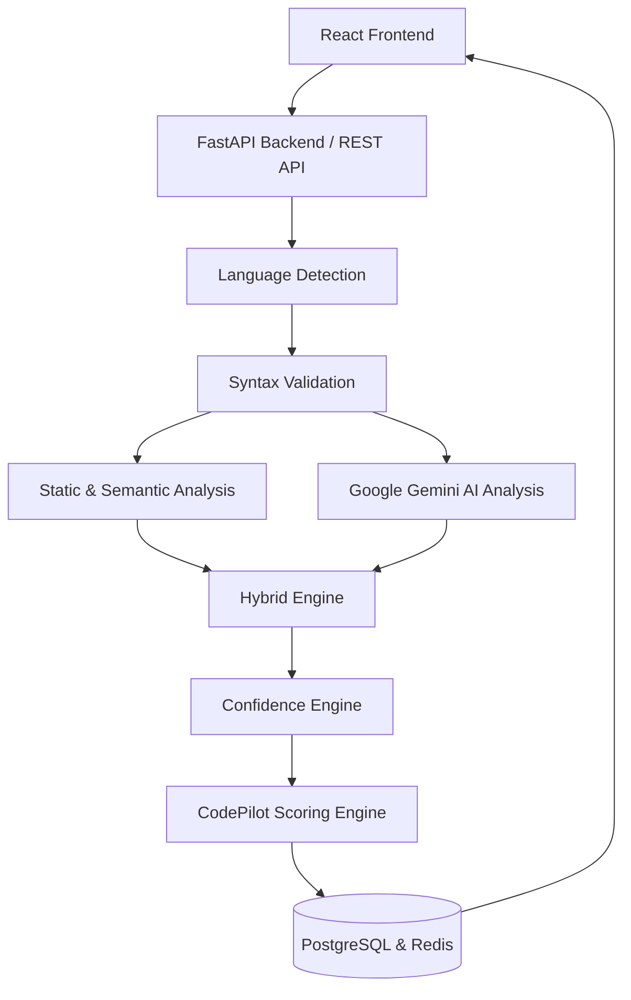

<div align="center">
  <h1>🚀 CodePilot</h1>
  <p><b>AI-Powered Multi-Language Code Review Assistant</b></p>
</div>

---

## 📖 Overview

**CodePilot** is an advanced AI-powered assistant designed to streamline your development workflows. By deeply integrating into your development pipeline, CodePilot helps developers automatically review code, generate intelligent insights, and maintain codebase health.

CodePilot analyzes your code using a robust hybrid engine that combines deterministic static analysis, language-specific AST semantics, and contextual AI insights to deliver an explainable and reliable code quality score.

## ✨ Key Features

- **Hybrid Code Review Pipeline**: Combines deterministic static analysis with contextual AI insights.
- **Explainable Scoring Engine**: An independent, confidence-aware scoring engine that evaluates security, performance, maintainability, and technical debt.
- **Multi-Language Support**: Full analysis support for C, C++, Java, Python, JavaScript, and TypeScript.
- **Security First**: Comprehensive vulnerability scanning and best practices enforcement.
- **Modern Interface**: A sleek React-based dashboard for managing code reviews and repository health.
- **Advanced Analytics**: Detailed reporting on repository health and coding patterns.

## 🏗️ Core Architecture



### The Hybrid Review Pipeline
1. **Deterministic Static Analysis & Language-Specific Semantic Analysis**: Fast, rule-based AST checks for well-known bugs, smells, and patterns.
2. **Google Gemini Contextual Analysis**: Complementary AI layer that finds complex logical errors and provides human-readable explanations.
3. **Hybrid Engine Deduplication**: Merges and deduplicates findings from both static and AI sources to prevent redundant issues.

### The CodePilot Scoring Engine
The final numerical score is **independently calculated** rather than blindly assigned by the AI. It is:
- **Deterministic & Explainable**: Mathematical formulation based on actual finding severity and density.
- **Confidence-Aware**: Adjusts penalties based on the confidence level of the analysis source.
- **LOC-Normalized**: Scales penalties appropriately based on the size of the file.
- **Holistic**: Combines Security, Performance, Maintainability, and Technical Debt into a unified health score.

## 💻 Tech Stack

| Category | Technology | Purpose |
| :--- | :--- | :--- |
| **Frontend** | React, TypeScript, Tailwind | User interface and dashboard. |
| **Backend** | Python, FastAPI | High-performance asynchronous REST API. |
| **Database** | PostgreSQL | Relational data mapping and persistence. |
| **Caching** | Redis | Session management and fast data retrieval. |
| **AI** | Google Gemini AI | Contextual code analysis (complementary). |
| **Containerization**| Docker, Docker Compose | Consistent environments across systems. |

## 📁 Project Structure

```
codepilot/
├── backend/              # FastAPI application
│   ├── app/              # Application logic, routers, scoring engine
│   ├── tests/            # Pytest suites
│   ├── Dockerfile        # Backend container definition
│   └── requirements.txt  # Python dependencies
├── frontend/             # React user interface
│   ├── src/              # React components and contexts
│   ├── package.json      # Node dependencies
│   └── Dockerfile        # Frontend container definition
├── docker-compose.yml    # Development Docker config
├── docker-compose.prod.yml# Production Docker config
└── README.md             # Project documentation
```

## 📊 Empirical Validation & Results

The CodePilot Scoring Engine has been rigorously evaluated against mathematical and external baselines. *(Note: These results demonstrate strong correlations under test conditions but do not claim universal correctness across all possible codebases.)*

### Mathematical Validation
- Boundedness: **PASS**
- Severity monotonicity: **PASS**
- Confidence monotonicity: **PASS**
- Non-improvement when adding issues: **PASS**
- Complexity monotonicity: **PASS**
- Exact weighted aggregation: **PASS**

### Test Coverage
- **46** scoring-engine tests passing.
- **75** Python-analyzer tests passing after performance/N+1 fixes.

### Sensitivity Analysis
- 27 Maintainability configurations & 6 Overall-weight configurations.
- Maintainability baseline Spearman ρ: **0.9392–0.9989**
- Overall baseline Spearman ρ: **0.9936–0.9967**
- Maximum score change: **25.75 points**
- Maximum ranking reversals: **39 / 190 pairs**

### External Validation
- Maintainability vs Radon MI: ρ = +0.3189, p = 0.1707, n = 20
- Security vs independent severity: ρ = -0.3853, p = 0.0935, n = 20
- Performance unseen holdout: ρ = -0.7890, p < 0.001, n = 15
- Performance holdout precision = **100%**
- Performance holdout recall = **62.5%**

## 🚀 Getting Started

### Prerequisites
- Docker & Docker Compose
- Node.js 18+ (for local frontend development)
- Python 3.10+ (for local backend development)

### Quick Start
1. **Clone the repository**
   ```bash
   git clone https://github.com/suchintanbiswas-design/CodePilot.git
   cd CodePilot
   ```

2. **Setup environment variables**
   ```bash
   cp .env.example .env
   # Edit .env with your specific secrets (especially GEMINI_API_KEY)
   ```

3. **Start the application**
   ```bash
   docker-compose up --build
   ```

## ⚙️ Environment Variables

| Variable | Description | Default |
| :--- | :--- | :--- |
| `APP_ENV` | Application environment (`development` or `production`). | `development` |
| `POSTGRES_USER` | Database username. | `codepilot` |
| `POSTGRES_PASSWORD` | Database password. | `changeme` |
| `POSTGRES_DB` | Database name. | `codepilot_db` |
| `JWT_SECRET_KEY` | Secret key for JWT authentication. | `super-secret-key` |
| `REDIS_URL` | Connection URL for Redis cache. | `redis://redis:6379/0` |
| `GEMINI_API_KEY` | API key for Google Gemini analysis. | `(required)` |

## 🧪 Testing

We use `pytest` for the backend and `vitest`/`jest` for the frontend.

```bash
# Run backend tests
cd backend
python -m pytest

# Run frontend tests
cd frontend
npm run test
```

## 🛠️ Deployment

CodePilot includes Docker Compose configurations for easy deployment to any Docker-compatible hosting environment (e.g., AWS EC2, DigitalOcean Droplets). 

Use `docker-compose.prod.yml` for production deployments.

## ⚠️ Known Limitations
- Real-time collaborative editing is not yet fully supported.
- The built-in AI models currently have a context window limitation based on the chosen Gemini tier.

## 📜 License
This project is licensed under the MIT License - see the [LICENSE](LICENSE) file for details.
