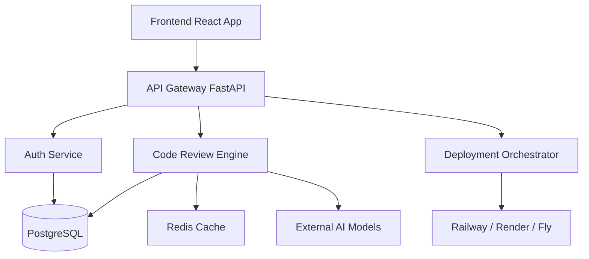
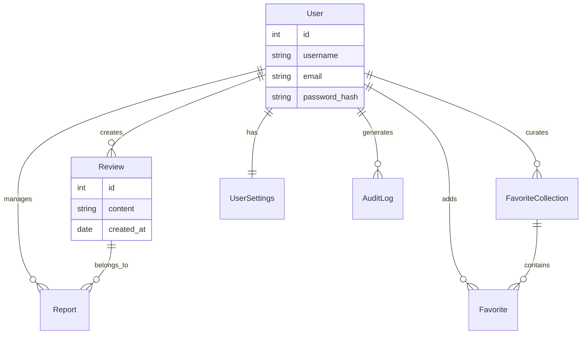

<div align="center">
  <h1>🚀 CodePilot</h1>
  <p>Your AI-Powered DevOps and Code Review Assistant.</p>
  
  [](#)
  [](https://opensource.org/licenses/MIT)
  [](http://makeapullrequest.com)
</div>

---

## 📖 Overview

**CodePilot** is an advanced AI-powered assistant designed to streamline your development and DevOps workflows. By deeply integrating into your development pipeline, CodePilot helps developers automatically review code, generate intelligent insights, manage documentation, and easily deploy high-quality applications. 

Whether you need automated pull request summaries, vulnerability detection, or DevOps infrastructure scaffolding, CodePilot is built to ensure a robust and accelerated software development lifecycle.

## ✨ Key Features

- 🤖 **AI Code Review**: Automated suggestions, linting, and architectural insights.
- 🐳 **Docker Integration**: One-click configuration for both dev and prod environments.
- 🚀 **Multi-Cloud Deployment**: Out-of-the-box configurations for Railway, Render, and Fly.io.
- 🔒 **Security First**: Comprehensive vulnerability scanning and best practices enforcement.
- 🎨 **Modern Interface**: A sleek React-based dashboard for managing projects and repositories.
- 📊 **Advanced Analytics**: Detailed reporting on repository health and coding patterns.

## 🏗️ Architecture



## 🛠️ Tech Stack

| Category | Technology | Purpose |
| :--- | :--- | :--- |
| **Frontend** | React, TypeScript, Tailwind | User interface and dashboard. |
| **Backend** | Python, FastAPI | High-performance asynchronous REST API. |
| **Database** | PostgreSQL | Relational data mapping and persistence. |
| **Caching** | Redis | Session management and fast data retrieval. |
| **Containerization**| Docker, Docker Compose | Consistent environments across environments. |

## 📂 Project Structure

```
codepilot/
├── .github/              # GitHub templates and workflows
├── backend/              # FastAPI application
│   ├── app/              # Application logic and routers
│   ├── tests/            # Pytest suites
│   ├── Dockerfile        # Backend container definition
│   └── requirements.txt  # Python dependencies
├── frontend/             # React user interface
│   ├── src/              # React components and contexts
│   ├── package.json      # Node dependencies
│   └── Dockerfile        # Frontend container definition
├── docker-compose.yml    # Development Docker config
├── docker-compose.prod.yml# Production Docker config
├── Makefile              # Helper scripts and aliases
└── README.md             # Project documentation
```

## 🗄️ Database Schema



## 🌐 API Overview

| Method | Endpoint | Description |
| :--- | :--- | :--- |
| `POST` | `/api/v1/auth/login` | Authenticate user and get JWT token. |
| `POST` | `/api/v1/auth/register`| Register a new user account. |
| `GET`  | `/api/v1/users/me`     | Get current logged in user details. |
| `POST` | `/api/v1/reviews`      | Trigger a new AI code review. |
| `GET`  | `/api/v1/reviews/{id}` | Fetch a specific review result. |
| `GET`  | `/api/v1/favorites`    | List favorite repositories/snippets. |

## 🚀 Getting Started

### Prerequisites
- Docker & Docker Compose
- Node.js 18+ (for local frontend development)
- Python 3.10+ (for local backend development)

### Quick Start
1. **Clone the repository**
   ```bash
   git clone https://github.com/your-org/codepilot.git
   cd codepilot
   ```

2. **Setup environment variables**
   ```bash
   cp .env.example .env
   # Edit .env with your specific secrets
   ```

3. **Start the application**
   ```bash
   make dev
   # Or manually: docker-compose up --build
   ```

## 🐳 Docker Setup

CodePilot provides distinct Docker Compose setups for development and production to optimize your workflow.

### Development
Includes hot-reloading for both React and FastAPI.
```bash
make dev
```

### Production
Optimized, multi-stage builds with proper security headers and limits.
```bash
make prod
```

## 🔐 Environment Variables

| Variable | Description | Default |
| :--- | :--- | :--- |
| `APP_ENV` | Application environment (`development` or `production`). | `development` |
| `DEBUG` | Enable verbose logging. | `true` |
| `POSTGRES_USER` | Database username. | `codepilot` |
| `POSTGRES_PASSWORD` | Database password. | `changeme` |
| `POSTGRES_DB` | Database name. | `codepilot_db` |
| `JWT_SECRET_KEY` | Secret key for JWT authentication. | `super-secret-key` |
| `REDIS_URL` | Connection URL for Redis cache. | `redis://redis:6379/0` |
| `OPENAI_API_KEY` | API key for AI features. | `(required)` |

## ☁️ Deployment

CodePilot includes ready-to-use configurations for major PaaS providers.

### Railway
1. Connect your GitHub repository to Railway.
2. Railway will automatically detect the `railway.json` file.
3. Configure your environment variables in the Railway dashboard.

### Render
1. Create a new "Blueprint" in Render.
2. Render will read the `render.yaml` file and deploy both the static frontend and Docker backend.

### Fly.io
1. Install the Fly CLI.
2. Run `fly launch` in the root directory. It will detect `fly.toml`.
3. Set your secrets: `fly secrets set JWT_SECRET_KEY=...`
4. Deploy: `fly deploy`

## 📸 Screenshots

*[Screenshots coming soon]*

## 🧪 Testing

We use `pytest` for the backend and `jest` for the frontend.

```bash
# Run all tests
make test

# Run only backend tests
make test-backend

# Run only frontend tests
make test-frontend
```

## 🩺 Troubleshooting

- **Database Connection Error**: Ensure that the `POSTGRES_PASSWORD` in your `.env` matches the configuration in `docker-compose.yml`.
- **Ports already in use**: If port `8000` or `80` is in use, modify the port mapping in `docker-compose.yml` or stop the conflicting service.
- **AI Features not responding**: Verify your `OPENAI_API_KEY` is valid and has sufficient quota.

## 🚧 Known Limitations

- Real-time collaborative editing is not yet fully supported.
- Limited out-of-the-box support for older version control systems (SVN/Mercurial).
- The built-in AI models currently have a context window limitation of 8k tokens.

## 🔭 Future Scope

- [ ] Native GitHub App integration.
- [ ] Enterprise SAML/SSO Authentication.
- [ ] Advanced visual deployment pipelines within the dashboard.
- [ ] Support for self-hosted LLMs (e.g., Llama 2, Mistral).

## 🤝 Contributing

We welcome contributions! Please see our [Contributing Guide](CONTRIBUTING.md) for detailed instructions on how to get started. By participating in this project, you agree to abide by our Code of Conduct.

## 📄 License

This project is licensed under the MIT License - see the [LICENSE](LICENSE) file for details.

## 🙏 Acknowledgments

- Thanks to the FastAPI and React communities.
- Shoutout to the incredible open-source tools that power CodePilot.
